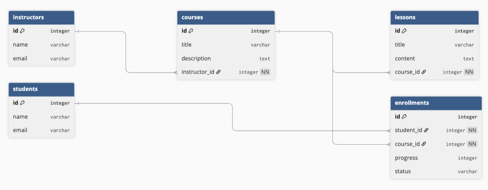

# School (Flask + React)

## Overview
School is a small full-stack app for managing instructors, courses, lessons, and student enrollments.
The project uses a Flask API + SQLAlchemy on the backend and a React UI on the frontend.

## Data Model
Entities:
- **Instructor**: `id`, `name`, `email`
- **Course**: `id`, `title`, `description`, `instructor_id`
- **Lesson**: `id`, `title`, `content`, `course_id`
- **Student**: `id`, `name`, `email`
- **Enrollment**: `id`, `student_id`, `course_id`, `progress`, `status`

Relationships:
- Instructor **has many** Courses
- Course **belongs to** Instructor
- Course **has many** Lessons
- Lesson **belongs to** Course
- Student **has many** Enrollments
- Course **has many** Enrollments
- Student **many-to-many** Course **through** Enrollment

## Features
- View lists and details for:
  - Instructors
  - Courses
  - Lessons
  - Students
- Enroll a student into a course by creating an **Enrollment** (with `status` and `progress`)
- **Full CRUD is implemented for Students only**:
  - Create student
  - Read student(s)
  - Update student
  - Delete student

## API
Base URL: `http://localhost:<backend-port>`

### Instructors
- GET `/instructors`
- GET `/instructors/<int:id>`
- POST `/instructors`
- PATCH `/instructors/<int:id>` (may exist even if UI doesn’t use it)
- DELETE `/instructors/<int:id>` (may exist even if UI doesn’t use it)

### Courses
- GET `/courses`
- GET `/courses/<int:id>`
- POST `/courses`
- PATCH `/courses/<int:id>` (may exist even if UI doesn’t use it)
- DELETE `/courses/<int:id>` (may exist even if UI doesn’t use it)

### Lessons
- GET `/lessons`
- GET `/lessons/<int:id>` (if implemented)
- POST `/lessons` (if implemented)
- PATCH `/lessons/<int:id>` (if implemented)
- DELETE `/lessons/<int:id>` (if implemented)

### Students (CRUD)
- GET `/students`
- GET `/students/<int:id>`
- POST `/students`
- PATCH `/students/<int:id>`
- DELETE `/students/<int:id>`

### Enrollments
- GET `/enrollments` 
- POST `/enrollments` (used to enroll a student into a course)

## Frontend Pages
Navigation:
- Instructors
- Courses
- Students
- Lessons

Students:
- Students list
- Student detail
- Student create
- Student edit
- Student delete

## Tech Stack
Backend:
- Python
- Flask
- Flask-RESTful 
- SQLAlchemy
- SQLite 

Frontend:
- React
- React Router
- Formik + Yup
- Bootstrap classes (based on UI)

## Getting Started

### Backend
1. Create and activate your virtual environment
2. Install dependencies
3. Run migrations (if your project uses them)
4. Start the server

Notes:
- If you use seed data, run your seed script before using the UI.

### Frontend
1. `cd client`
2. Install dependencies
3. Start React dev server
4. Open `http://localhost:3000`

## Notes
- The UI is designed so newly created records should appear immediately without a full page reload by updating React state after successful POST requests.
- Some PATCH/DELETE endpoints may exist in the API even if the current UI does not use them.